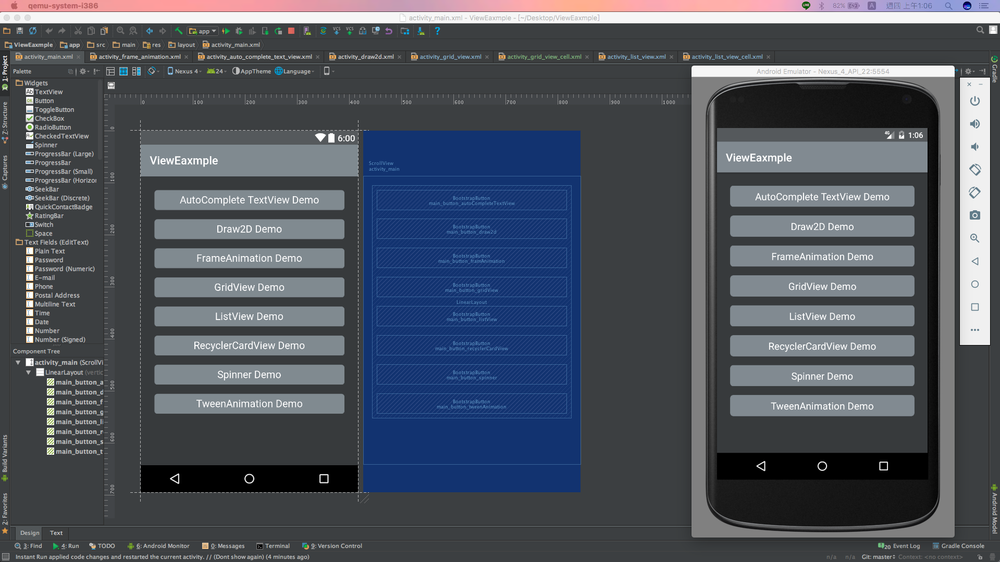
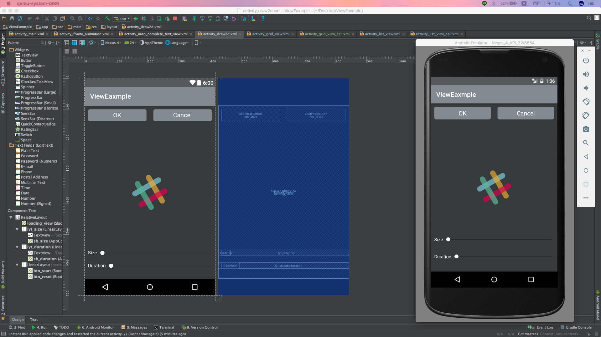
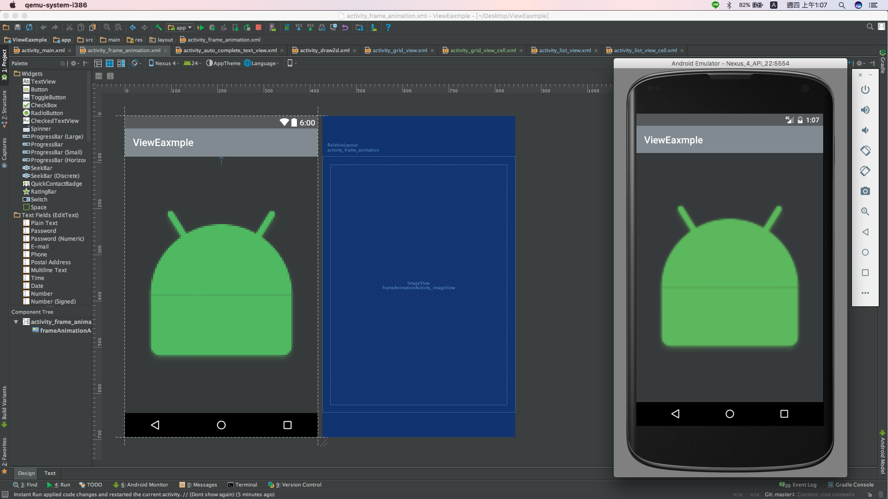
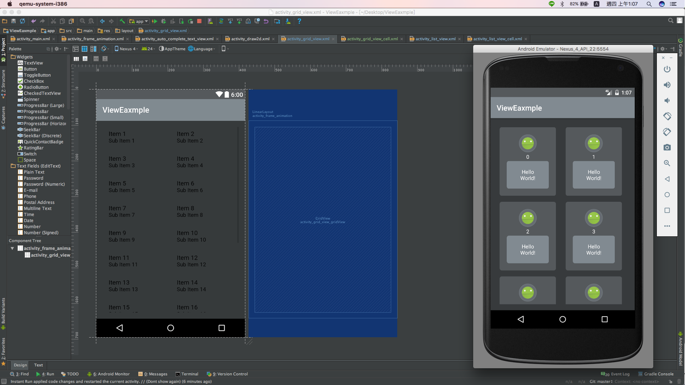
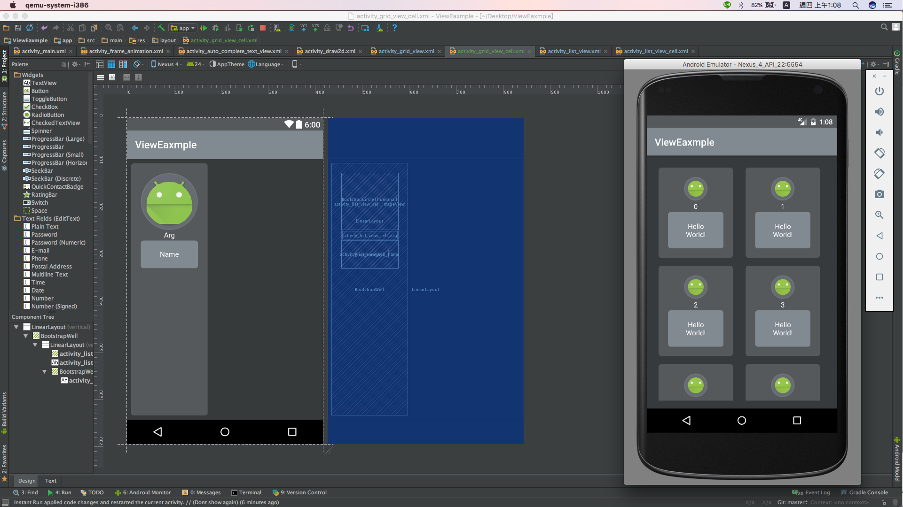
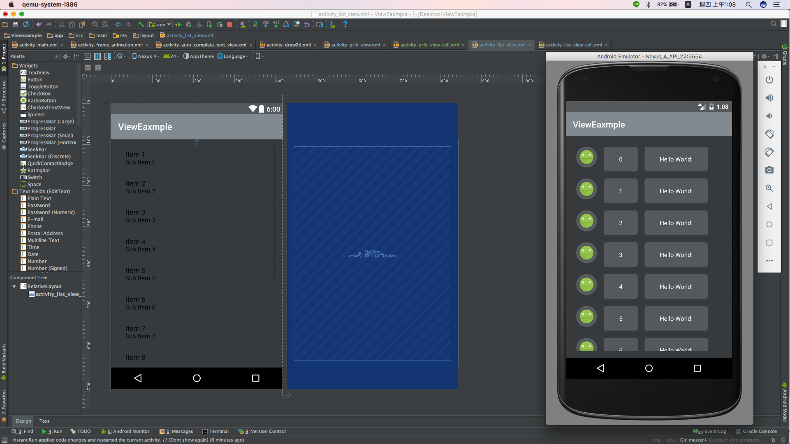
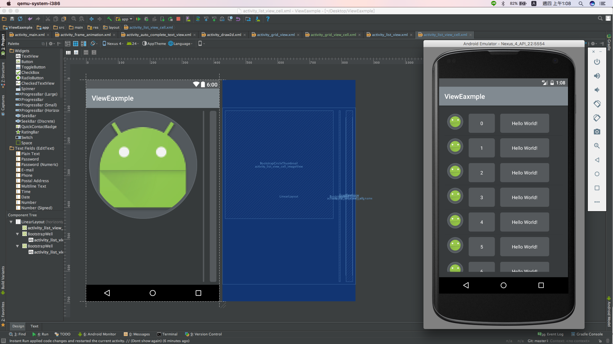

# 在 Android 上的各種 Layout 教學
##### AutoComplete TextView (自動建議的 EditText)
##### Draw2D (2D繪圖)
##### FrameAnimation ()
##### GridView (網格選單)
##### ListView (列表選單)
##### RecyclerCardView (恢復選單)
##### Spinner (下拉式選單)
##### TweenAnimation ()

```Java
/**
 * 講義：
 * http://epaper.gotop.com.tw/PDFSample/AEL016331.pdf
 *
 * 採用：
 * https://github.com/Bearded-Hen/Android-Bootstrap
 */
```

### 主頁(activity_main)


我們在這裡只需要賦予所有的按鈕擁有換頁功能。

```Java
// 如果首頁 Button 被點擊了，就觸發這項事件。
public void main_Button_Click(View view) {
    // 建立 Intent 元件（應用程式的意圖或使用者的意圖）
    Intent intent = new Intent();
    // 篩選 view 傳入的 R.id
    switch (view.getId()) {
        // 如果這個 R.id 是 R.id.main_button_autoCompleteTextView
        case R.id.main_button_autoCompleteTextView:
            // 賦予 Intent(意圖) 事件的起始地、目的地
            intent.setClass(this, autoCompleteTextViewActivity.class);
            break;

        // 如果這個 R.id 是 R.id.main_button_draw2d
        case R.id.main_button_draw2d:
            // 賦予 Intent(意圖) 事件的起始地、目的地
            intent.setClass(this, draw2dActivity.class);
            break;

        // 如果這個 R.id 是 R.id.main_button_framAnimation
        case R.id.main_button_framAnimation:
            // 賦予 Intent(意圖) 事件的起始地、目的地
            intent.setClass(this, frameAnimationActivity.class);
            break;

        // 如果這個 R.id 是 R.id.main_button_gridView
        case R.id.main_button_gridView:
            // 賦予 Intent(意圖) 事件的起始地、目的地
            intent.setClass(this, gridViewActivity.class);
            break;

        // 如果這個 R.id 是 R.id.main_button_listView
        case R.id.main_button_listView:
            // 賦予 Intent(意圖) 事件的起始地、目的地
            intent.setClass(this, listViewActivity.class);
            break;

        // 如果這個 R.id 是 R.id.main_button_recyclerCardView
        case R.id.main_button_recyclerCardView:
            // 賦予 Intent(意圖) 事件的起始地、目的地
            intent.setClass(this, recyclerCardViewActivity.class);
            break;

        // 如果這個 R.id 是 R.id.main_button_spinner
        case R.id.main_button_spinner:
            // 賦予 Intent(意圖) 事件的起始地、目的地
            intent.setClass(this, spinnerActivity.class);
            break;

        // 如果這個 R.id 是 R.id.main_button_tweenAnimation
        case R.id.main_button_tweenAnimation:
            // 賦予 Intent(意圖) 事件的起始地、目的地
            intent.setClass(this, tweenAnimationActivity.class);
            break;

        // 如果這個 R.id 都不是以上的種類
        default:
            // 賦予 Intent(意圖) 事件的起始地、目的地
            intent.setClass(this, MainActivity.class);
            break;
    }
    // 啟動換頁活動
    startActivity(intent);
    // 結束當前的這一頁活動
    finish();
}
```

### AutoComplete TextView (自動建議的 EditText)


首先要有個 AutoCompleteTextView，再來我想要在這裡面輸入內容，按下 OK Button(按鈕)後，把資料儲存到程式當中，方便我下一次取值，所以在頁面的部分我們需要一個 AutoCompleteTextView 以及一個 Button。

```xml
<AutoCompleteTextView
    android:id="@+id/autoCompleteTextViewActivity_autoCompleteTextView"
    android:layout_width="match_parent"
    android:layout_height="wrap_content"
    android:text=""
    android:textColor="@android:color/white" />
    
<com.beardedhen.androidbootstrap.BootstrapButton
    android:id="@+id/bootstrapButton"
    android:layout_width="match_parent"
    android:layout_height="wrap_content"
    android:layout_alignParentBottom="true"
    android:layout_alignParentStart="true"
    android:layout_marginLeft="8dp"
    android:layout_marginRight="8dp"
    android:onClick="autoCompleteTextView_Button_Click"
    android:text="@android:string/ok"
    app:bootstrapBrand="regular"
    app:bootstrapSize="lg"
    app:buttonMode="regular"
    app:roundedCorners="true"
    app:showOutline="false" />
```

然後在程式當中，先設定需要的全域變數：

```Java
// 建立全域 AutoCompleteTextView 元件
private AutoCompleteTextView textView;
// 建立全域 ArrayAdapter<String> 轉接器元件
private ArrayAdapter<String> arrayAdapter;
// 建立全域 ArrayList<String> 存值的元件
private ArrayList<String> countries = new ArrayList<>();
```

接下來我們該思考，當 onCreate 啟動之後，我們必須要程式執行哪些事情，把該載入的元件都先載入完畢，然後指定實數、指定橋接器、指定點擊事件 ... 等等。

```Java
// 設定 ArrayAdapter，採用系統預設的 android.R.layout.simple_dropdown_item_1line 樣式，並賦予資料 this.countries
this.arrayAdapter = new ArrayAdapter<>(this, android.R.layout.simple_dropdown_item_1line, this.countries);
// 指定全域 AutoCompleteTextView 元件
this.textView = (AutoCompleteTextView) findViewById(R.id.autoCompleteTextViewActivity_autoCompleteTextView);
// 指定閾值的實數
this.textView.setThreshold(1);
// 指定元件的橋接器(Adapter)
this.textView.setAdapter(this.arrayAdapter);
// 指定元件的 Item 如果被點擊的事件
this.textView.setOnItemClickListener(new AdapterView.OnItemClickListener() {
    // 複寫
    @Override
    public void onItemClick(AdapterView<?> parent, View view, int position, long id) {
        // 取得被指定 Item 的內容
        String item = parent.getItemAtPosition(position).toString();
        // 利用吐司訊息 show 出被點擊的內容
        Toast.makeText(autoCompleteTextViewActivity.this, item, Toast.LENGTH_SHORT).show();
    }
});
```

再來如果按鈕被點了，我們需要把輸入框的值寫入程式資料當中，以供輸入框下次自動判斷字典。

```Java
// OK Button(按鈕)被點擊的事件
public void autoCompleteTextView_Button_Click(View view) {
    // 取得 AutoCompleteTextView 輸入框的內容
    String editText = this.textView.getText().toString();
    // 將 AutoCompleteTextView 輸入框的內容設定為空 ""
    this.textView.setText("");
    // 如果輸入的內容為空
    if (editText.isEmpty()) {
        // 利用吐司訊息告知
        Toast.makeText(this, "內容不得為空。", Toast.LENGTH_SHORT).show();
        // 利用 checkData() 來確認輸入的內容是否重複
    } else if (this.checkData(editText)) {
        // 利用吐司訊息告知
        Toast.makeText(this, editText + " 這個內容已經存在了。", Toast.LENGTH_SHORT).show();
        // 如果輸入的內容不為空，且不重複
    } else {
        // 在 全域 ArrayList<String> 新增資料
        this.countries.add(editText);
    }
    // 刷新 Adapter 橋接器的資料
    updatedData(this.countries);
}
```

可是只是把資料寫進程式當中，還是沒辦法讓程式找尋歷史字典，因為我們必須去更新橋接器裡面的資料，所以又寫了一個方法。

```Java
// 更新 Adapter 橋接器的資料
private void updatedData(ArrayList<String> itemsArrayList) {
    // 刪除 Adapter 底層的資料
    this.arrayAdapter.clear();
    // 如果 itemsArrayList 不是空的
    if (itemsArrayList != null) {
        // 利用 foreach 探索所有 itemsArrayList 的值
        for (String str : itemsArrayList) {
            // 新增資料到 arrayAdapter 底層
            this.arrayAdapter.insert(str, this.arrayAdapter.getCount());
        }
    }
    // 更新 this.arrayAdapter 的資料
    this.arrayAdapter.notifyDataSetChanged();
}
```

到這邊基本上就沒問題了，但還有些許 Bug 存在，如果什麼都不輸入，或者輸入重複的下去儲存資料，那程式會跑錯誤，所以我們必須要有一個驗證機制，來防止這種事情發生。

```Java
// 確認 this.countries 的值是否重複，如果重複則回傳 true，如果沒有則回傳 false。
private boolean checkData(String _str) {
    // 利用 foreach 探索所有 this.countries 的值
    for (String str : this.countries) {
        // 判斷 _str 是否等同 str
        if (_str.equals(str)) {
            // 回傳 true
            return true;
        }
    }
    // 回傳 false
    return false;
}
```

### Draw2D (2D繪圖)



請參閱：\
https://github.com/JeasonWong/SlackLoadingView\
另外一些注意事項：

```Java
/**
 * 在新建 Draw2D 畫布時，必須注意這個地方：
 * <專案名.畫布名稱 ... />
 */
```

### FrameAnimation ()



### GridView (網格選單)、ListView (列表選單) 需要用到的 PostAdapter

我們必須設計一個 Adapter(轉接器) 來給予 GridView (網格選單)、ListView (列表選單) 使用，所以新建一個空的 class 並且繼承(extends) BaseAdapter 這個抽象類別(abstract)，並且去實作一些必須實作的方法，如果對 Android 原生有興趣的話，可以把文件打開來看，或者是到 Android Developer 去欣賞。

```Java
// 自建一個 PostAdapter(轉接器)，並繼承 BaseAdapter
public class PostAdapter extends BaseAdapter {
    // Code ...
}
```

首先我們必須實作的方法有四個，分別為 getCount()、getItem()、getItemId()、getView()，程式碼及解說大概如下：

```Java
// (1)複寫長度方法
@Override
public int getCount() {
    // 回傳 Post(Cell) 的長度
    return postList.size();
}

// (2)複寫取得 Post(Cell) 的方法
@Override
public Object getItem(int position) {
    // 回傳目標 Post(Cell)，例如被點到10號 Post(Cell)，就會回傳 postList.get(10))
    // 像 onItemClick 事件的 (... int position ...)
    return postList.get(position);
}

// (3)複寫取得 Post(Cell) 編號的方法
@Override
public long getItemId(int position) {
    // 回傳目標 Post(Cell) 的編號，例如被點到 10 號 Post(Cell)，就會回傳 10 號
    // 像 onItemClick 事件的 (... long id)
    return postList.get(position).getArg();
}

// (4)複寫取得目標 Post(Cell) 畫面(Item View) 的方法
@Override
public View getView(int position, View convertView, ViewGroup parent) {
    // 如果 convertView 是空的
    if (convertView == null)
        // 就給它一個 View，這個 View 是自訂的 activity_list_view_cell
        convertView = layoutInflater.inflate(this.cellLayout, parent, false);

    // 取得目標 Post 的資料
    Post post = postList.get(position);

    // 抓取 convertView 的 ImageView，並指定它顯示的圖片
    ((ImageView) convertView.findViewById(R.id.activity_list_view_cell_imageView)).setImageResource(post.getImage());

    // 抓取 convertView 的 TextView(Arg)，並指定它顯示的內容
    ((TextView) convertView.findViewById(R.id.activity_list_view_cell_arg)).setText(String.valueOf(post.getArg()));

    // 抓取 convertView 的 TextView(Name)，並指定它顯示的內容
    ((TextView) convertView.findViewById(R.id.activity_list_view_cell_name)).setText(post.getName());

    // 將整個 convertView 回傳
    return convertView;
}
```

再來我們必須定義種子包(Post)：

```Java
// 存放資料的種子
class Post {
    // 定義 ImageView 的 R.id
    protected int imageId;
    // 定義 TextView(Arg) 的值
    protected int arg;
    // 定義 TextView(Name) 的值
    protected String name;

    public Post(int imageId, int arg, String name) {
        this.setImage(imageId);
        this.setArg(arg);
        this.setName(name);
    }

    public int getImage() {
        return this.imageId;
    }

    public int getArg() {
        return this.arg;
    }

    public String getName() {
        return this.name;
    }

    private void setImage(int imageId) {
        this.imageId = imageId;
    }

    private void setArg(int arg) {
        this.arg = arg;
    }

    private void setName(String name) {
        this.name = name;
    }
}
```

最後我們把該用一用的弄一弄：

```Java
protected int cellLayout;
protected LayoutInflater layoutInflater;
protected List<Post> postList = new ArrayList<>();

public PostAdapter(Context context) {
    if (context.getClass().equals(listViewActivity.class))
        this.cellLayout = R.layout.activity_list_view_cell;
    else
        this.cellLayout = R.layout.activity_grid_view_cell;

    this.layoutInflater = LayoutInflater.from(context);
    // 利用 for 迴圈去建造 50 筆資料
    for (int i = 0; i < 50; i++)
        postList.add(new Post(R.mipmap.ic_launcher, i, "Hello World!"));
}
```

### GridView (網格選單)



在做 GridView (網格選單) 之前，這東西的 版面(xml) 與 ListView(列表選單) 不太一樣，它多了 numColumns 這東西，這是比較需要注意的部分，在 xml 裡頭大概像這樣：

```xml
<GridView
    android:id="@+id/activity_grid_view_gridView"
    android:layout_width="match_parent"
    android:layout_height="match_parent"
    android:layout_gravity="center_horizontal"
    android:numColumns="auto_fit" />
```

透過上面建立的 種子(Post) 與 橋接器(Adapter)，我們接下來就可以在 onCreate() 很輕鬆的完成接下來要做的事情了。

```Java
// 指定在頁面當中的 GridView 元件
GridView gridView = (GridView) findViewById(R.id.activity_grid_view_gridView);
// 賦予 GridView 一個 Adapter 元件
gridView.setAdapter(new PostAdapter(this));
// 賦予 OnItemClick 選項被點擊的事件
gridView.setOnItemClickListener(new AdapterView.OnItemClickListener() {
    @Override
    public void onItemClick(AdapterView<?> parent, View view, int position, long id) {
        // 取得被點擊的 Item(Cell)
        Post post = (Post) parent.getItemAtPosition(position);
        // 建立一個 ImageView
        ImageView imageView = new ImageView(gridViewActivity.this);
        // 把被點擊的 Image 放到剛剛建立的 ImageView 當中
        imageView.setImageResource(post.getImage());
        // 新建一個 Toast(吐司訊息)
        Toast toast = new Toast(gridViewActivity.this);
        // 把 ImageView 塞到 Toast(吐司訊息) 當中
        toast.setView(imageView);
        // 設定 Toast(吐司訊息) 的顯示持續時間
        toast.setDuration(Toast.LENGTH_SHORT);
        // 讓 Toast(吐司訊息) show 在畫面上
        toast.show();
    }
});
```

### ListView (列表選單)



ListView 跟 GridView 差不多，作法幾（是根本）乎一模一樣。

```Java
// 指定在頁面當中的 ListView 元件
ListView listView = (ListView) findViewById(R.id.activity_list_view_listView);
// 賦予 ListView 一個 Adapter 元件
listView.setAdapter(new PostAdapter(this));
// 賦予 OnItemClick 選項被點擊的事件
listView.setOnItemClickListener(new AdapterView.OnItemClickListener() {
    @Override
    public void onItemClick(AdapterView<?> parent, View view, int position, long id) {
        // 取得被點擊的 Item(Cell)
        Post post = (Post) parent.getItemAtPosition(position);
        // 取得 Item(Cell) 當中的 Arg 與 Name
        String text = "Arg : " + post.getArg() + "\nName : " + post.getName();
        // 以 Toast(吐司訊息) show 出內容
        Toast.makeText(listViewActivity.this, text, Toast.LENGTH_SHORT).show();
    }
});
```

### RecyclerCardView (恢復選單)


### Spinner (下拉式選單)


### TweenAnimation ()
